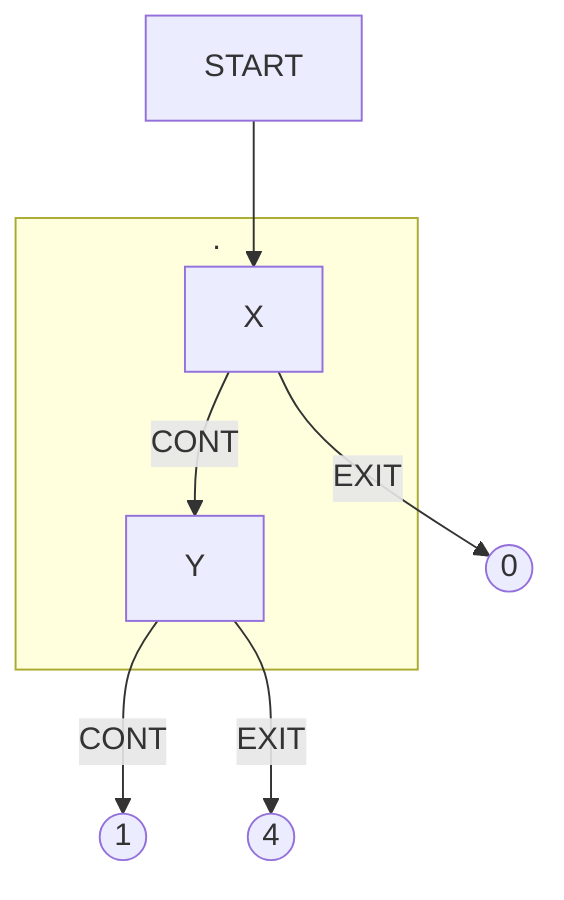

# The Absent-Minded Driver

# References
Aumann, Robert J., Sergiu Hart, and Motty Perry. "The absent-minded driver." *Games and Economic Behavior* 20.1 (1997): 102-116. [Link](https://doi.org/10.1006/game.1997.0577)
Piccione, Michele, and Ariel Rubinstein. "On the interpretation of decision problems with imperfect recall." *Games and Economic Behavior* 20.1 (1997): 3-24. [Link](https://doi.org/10.1006/game.1997.0536)
